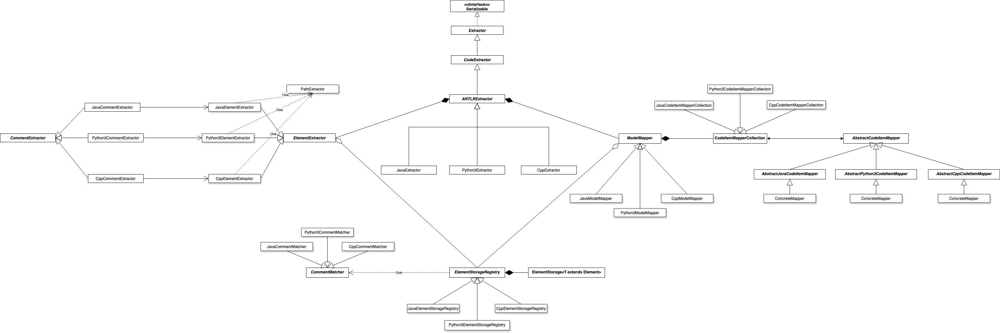
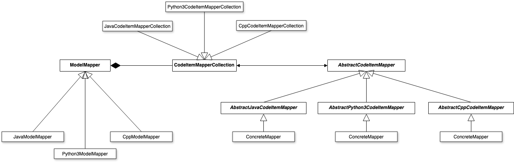

# ArDoCo Code Extraction by Gabriel Gehrig
in "Praktikum: Werkzeuge für agile Modellierung" - WS 2024-2025

## Table of Contents
- [Introduction](#introduction)
- [System Overview](#system-overview)
- [Architectural Design Decisions](#architectural-design-decisions)
- [Class Diagrams & Components Breakdown](#class-diagrams--components-breakdown)
- [Testing](#testing)
- [Adding support for other programming languages](#guide-adding-a-new-language)
- [Conclusion & Future Work](#conclusion--future-work)

## Introduction

### Task description
ArDoCo performs consistency analyses between different types of artifacts and utilizes connections between related artifacts in software development (trace links).
Currently, only Java source code can be interpreted. In this internship, the ArDoCo is to be extended:
* extend the code extractor to support additional programming languages (e.g. Python)
* develop a gold standard for testing extraction and the corresponding Traceability Link Recovery (TLR) (?)

### Scope
This project enhances **code extraction** for the **ArDoCo** tool by integrating [**ANTLR**](https://www.antlr.org/). The primary goal is to simplify future extensions, allowing support for additional programming languages with ease. To achieve this, significant effort has been invested in making the **code extraction process highly modular**. The extraction process concludes with the construction of the **CodeModel**, which is essential for **ArDoCo's analysis**.

### Technologies
* [ANTLR](https://www.antlr.org/)
* [ANTLR Grammars v4](https://github.com/antlr/grammars-v4)
* [GITLAB](https://gitlab.kit.edu/kit/kastel/sdq/stud/praktika/wise2425/gabrielgehrig)

## System Overview
##### Figure 1: Component Diagram of Code Extraction within ArDoCo

### General Description
The introduced **code extraction process** is divided into three key phases: **extracting** relevant information, **mapping** it to the appropriate constructs provided by the **ArDoCo Framework**, and **storing** the extracted data.

The modularity of this approach has been tested by encapsulating the extraction process for different programming languages, **Java**, **Python**, and **C++**. Additionally, its flexibility has been demonstrated by incorporating a new functionality, **CommentExtraction**.

### Extracting Code
<!--TODO: Compare after testing with "Real World Scenarios"-->
Code extraction is performed by creating a **JavaExtractor**, **PythonExtractor**, or **CppExtractor** object. This process requires specifying a CodeItemRepository along with the system path to the project's root folder, from which the extraction will be conducted.

### High-Level Architecture
As shown in [**Figure 1**](#figure-1-component-diagram-of-code-extraction-within-ardoco), the code extraction process is structured into three core components, each playing a distinct role in processing source code:

1️⃣ **(Core) Extraction Component** – Responsible for retrieving relevant information from the source code. This component interacts with ANTLR
to extract code information from different programming languages.

2️⃣ **Storage Component** – Once extracted, the information is stored and structured efficiently. This component ensures consistency and enables access to the retrieved data, even programming language specific information.

3️⃣ **Mapping Component** – The extracted and stored information is mapped to the appropriate constructs within the ArDoCo Framework, ensuring compatibility with the overall system for further processing and analysis.

These components work together in a modular fashion, allowing easy extensibility for new programming languages. The **Extraction Module** operates independently for different languages (Java, Python, C++) but **relies on the Storage Module** to persist data. The **Mapping Module** then transforms the stored data into a format that the ArDoCo Framework can process further.

For a more detailed breakdown of the system's structure, refer to Section: [Class Diagram & Component Breakdown](#class-diagram--component-breakdown).

### System Requirements
* Windows 11
* MacOS Sequoia
* (Linux - has not been tested, but path behavior should be similar to MacOS)

## Architectural Design Decisions

### Tooling
The previous solution for code extraction utilized the **Eclipse ASTParser**, a tool designed specifically for extracting structural elements from **Java** code. However, since support for multiple programming languages was required, it became evident that a different approach was necessary. The goal was to identify a tool that:
- Supports parsing multiple programming languages.
- Integrates easily into the existing project setup.
- Offers a stable and well-maintained solution for code extraction.

After evaluating several tools, the following candidates were considered:

#### Evaluated Tools

1️⃣ **Eclipse Xtext**

✅ Pros:
- Provides an infrastructure for defining domain-specific languages (DSLs).
- Supports language parsing and processing.

❌ Cons:

- Requires an Eclipse-based environment, which adds unnecessary constraints to the project.
- Setup complexity makes it less suitable for standalone code extraction.

💡 Decision: Immediately discarded due to **tight integration with Eclipse** and **unsuitability** for multi-language code extraction.

2️⃣ **Tree-Sitter**

✅ Pros:

- A powerful incremental parsing library that can efficiently parse multiple programming languages.
- Supports fast parsing, making it useful for real-time analysis.

❌ Cons:

- Primarily designed for syntax highlighting and IDE-based parsing, not structured extraction.
- Would require additional custom parsing logic to extract the necessary structural elements.

💡 Decision: While **promising**, Tree-Sitter requires **additional overhead** to transform raw syntax trees into structured elements, making it **less convenient** for this use case.

3️⃣ ANTLR (Chosen Solution)

✅ Pros:

- Supports numerous programming languages, making it the best fit for a multi-language extraction approach.
- Easily integrates with Maven, which aligns with the existing project setup.
- Well-documented and widely used, ensuring long-term maintainability.
	Allows flexible grammar definition, making it suitable for structural code extraction.

💡 Decision: ANTLR was selected as the **best-suited** tool due to its **wide language support**, **ease of integration** via Maven, and **ability to generate structured parse trees**.

### Top-Down vs. Bottom-Up
When designing the **extraction process**, a key architectural decision was choosing between **Top-Down** and **Bottom-Up** approaches for **parsing and persisting** extracted data. This decision impacts how extracted elements are stored and how relationships (e.g., parent-child structures) are maintained.

1️⃣ **Top-Down**
In a Top-Down approach, parsing starts from high-level constructs (e.g., classes, methods) and progressively breaks them down into finer-grained elements (e.g., statements, variables). This aligns naturally with how recursive descent parsers like ANTLR process input.

✅ Pros:
- **Fits well with ANTLR’s recursive descent parsing**, making it a natural integration.
- **Better contextual awareness**, since the parent elements (e.g., classes) are known before child elements (e.g., methods, variables).
- **Easier to enforce hierarchical constraints** (e.g., ensuring every method belongs to a class).

❌ Cons:
- **Limits modularity in persistence**, as child elements depend on their parent objects being created first.
- **Potential risk of missing objects**, since skipped or faulty parent extraction may result in lost child elements.
- **Harder to extend** for new languages, as parent structures must always be well-defined before extracting lower-level elements.

2️⃣ **Bottom-Up**
In a Bottom-Up approach, extraction starts from low-level constructs (e.g., tokens, variables, statements) and gradually assembles them into larger structures (e.g., methods, classes). Instead of relying on a predefined hierarchy, elements are collected independently and later linked together.

✅ Pros:
- **Increased modularity** – Elements are extracted independently, allowing greater flexibility when adding new languages or features.
- **Reduces dependency on parent elements**, making it more resilient to partial extraction failures.
- **Better support for multi-language integration**, since each extracted unit is self-contained.

❌ Cons:
- **Additional overhead**, as extracted elements must be linked together after extraction, rather than inherently forming a hierarchy during parsing.
- **Requires additional processing logic** to correctly associate child elements with their respective parent structures.

💡 Decision: While the Bottom-Up approach introduces **additional overhead**, **modularity** is a key factor for this project. By extracting individual elements first and linking them later, this approach aims to ensure:

- **Greater extensibility** for additional programming languages.
- **More flexibility** in structuring persistence models.
- **Better resilience** to parsing errors, preventing the loss of entire structures due to a single failure.

Thus, the **Bottom-Up** approach was implemented, ensuring a scalable, modular, and language-agnostic extraction process.

### ANTLR Listener vs. ANTLR Visitor
[ANTLR](https://www.antlr.org/) provides two approaches for extracting code elements: **Listeners** and **Visitors**. The choice between them significantly impacts the structure of the code **extraction**, making it an important architectural decision.

1️⃣ **Listeners**

✅ Pros:
- **Automatic invocation** – Methods are called automatically when a node is visited
- **Fixed structure** – Events fire in a predefined manner, ensuring consistency.**
- **Processes all nodes** – Ensures every part of the tree is processed.

❌ Cons:
- **Harder to customize behavior**, as execution flow is controlled by ANTLR.
- Must **react to all nodes**, even if only a subset is relevant.
- **Limited flexibility** in skipping or modifying traversal order.

2️⃣ **Visitors**
✅ Pros:
- **Explicit control over traversal** – The program decides which nodes to visit and in what order.
- **More modular** – Logic can be broken into separate visitor classes, improving maintainability.
- **Easier to customize** – Selectively process only relevant elements.
- **Can skip unnecessary nodes**, reducing processing overhead.

❌ Cons:
- Requires **manual control of traversal**, making it more complex to implement

💡 Decision: While the Listener Pattern provides automatic event handling, the Visitor Pattern aligns better with the project's goal of creating a modular, scalable, and language-independent extraction system.
Thus, the **Visitor Pattern** was chosen for this project.

### Generic Mapping vs. Specific Mapping
A key design consideration in the **mapping process** was whether to adopt a **generic mapping** approach — a standardized method for converting extracted elements into the ArDoCo Framework — or to allow **language-specific mappings** that accommodate unique elements from different programming languages.

1️⃣ Generic Mapping Approach

The goal of generic mapping is to establish a **unified and standardized** mapping process that ensures consistency across multiple programming languages. This approach promotes uniformity and reduces complexity by applying the same mapping logic to all extracted elements.

✅ Pros:
- Ensures a **consistent structure** for extracted elements.
- **Simplifies integration** with the ArDoCo Framework.
- **Reduces maintenance effort** by minimizing language-specific logic.

❌ Cons:
- **Limited flexibility** — cannot capture language-specific constructs that hold additional relevant information.
- **Risk of data loss**, as unique features from certain languages may not be correctly represented.

2️⃣ Specific Mapping Approach

While a standardized mapping approach is beneficial, it was recognized that **different programming languages contain unique structural elements** that **could provide additional valuable information**. By allowing specific mappings, the system gains flexibility in handling language-specific constructs while still ensuring compatibility with the ArDoCo Framework.

✅ Pros:
- **Supports language-specific features**, preserving valuable contextual information.
- **Enables more precise extraction**, improving analysis quality.
- **Increases extensibility**, allowing seamless support for future programming languages.

❌ Cons:
- **Requires additional mapping logic** for each supported language.
- **Slightly increases complexity** in maintaining multiple mapping strategies.

💡 Decision: Since both approaches offer significant advantages, a **hybrid solution** was introduced. This approach enables:
- **Generic mapping for common elements**, ensuring standardization across languages.
- **A flexible mechanism to incorporate language-specific mapping** when needed.
- **Scalability**, making it easier to extend the framework for future languages without requiring major structural changes.

## Class Diagrams & Components Breakdown
0️⃣ Complete Overview

1️⃣ ANTLRExtractor

This diagram provides an overview of the entry point to the code extraction process.

The classes Extractor and CodeExtractor already existed in the previous approach. With the integration of ANTLR, the extraction process now begins in ANTLRExtractor, which manages the process of extraction when using ANTLR.

| Class Name | Purpose |
|------------|---------|
| **`ANTLR Extractor`** | Defines the overall extraction process. Responsible for setting up extraction, managing, and mapping elements. |
| **`JavaExtractor`** | Sets up elements used specific to **JAVA**. Determines which Java files in the target directory should be processed.|
| **`Python3Extractor`** | Sets up elements used specific to **Python3**. Determines which Python files in the target directory should be processed. |
| **`CppExtractor`** | Sets up elements used specific to **C++**. Determines which C++ files in the target directory should be processed.|

2️⃣ Extraction

This diagram provides an **overview of the extraction** for **structural elements and comments** from source code. The **extraction** ensures that relevant code constructs are **identified, and extracted** for further processing.

| **Class Name** | **Purpose** |
|---------------|------------|
| **`ElementExtractor`** | Implements the **core functions** for extracting **structural elements** from source code. |
| **`JavaElementExtractor`** | Implements **extraction logic** for structural elements in **Java**. |
| **`Python3ElementExtractor`** | Implements **extraction logic** for structural elements in **Python3**. |
| **`CppElementExtractor`** | Implements **extraction logic** for structural elements in **C++**. |
| **`CommentExtractor`** | Defines the **process of extracting comments** from source code. |
| **`JavaCommentExtractor`** | Implements **rules for recognizing valid comments** in **Java**. |
| **`Python3CommentExtractor`** | Implements **rules for recognizing valid comments** in **Python3**. |
| **`CppCommentExtractor`** | Implements **rules for recognizing valid comments** in **C++**. |
| **`PathExtractor`** | Defines the logic for **extracting and processing file paths** within a project structure. |

3️⃣ Management

This diagram provides an **overview of how extracted structural elements** from source code are **managed, stored, and retrieved**. It ensures that extracted elements are **persisted efficiently** and can be **retrieved when needed for further processing**.

| **Class Name** | **Purpose** |
|---------------|------------|
| **`ElementStorageRegistry`** | Defines the **core logic** for **persisting and retrieving extracted elements**. |
| **`ElementStorage`** | Responsible for **persisting and retrieving extracted elements**, ensuring structured storage. |
| **`JavaElementStorageRepository`** | Defines the **composition of ElementStorages** specific to **Java**. |
| **`Python3ElementStorageRepository`** | Defines the **composition of ElementStorages** specific to **Python3**. |
| **`CppElementStorageRepository`** | Defines the **composition of ElementStorages** specific to **C++**. |
| **`CommentMatcher`** | Defines the **core logic** of matching extracted **comments** to **elements** |
| **`JavaCommentMatcher`** | Defines the **Java** specific rules according to commenting habits for mapping **comments** to **elements** |
| **`Python3CommentMatcher`** | Defines the **Python 3** specific rules according to commenting habits for mapping **comments** to **elements** |
| **`CppCommentMatcher`** | Defines the **C++** specific rules according to commenting habits for mapping **comments** to **elements** |

4️⃣ Mapping

This diagram provides an overview of the mapping process, where extracted elements are converted into CodeItems that the ArDoCo Framework defines. The mapping ensures that extracted code structures are correctly interpreted and integrated into the framework.

| **Class Name** | **Purpose** |
|---------------|------------|
| **`ModelMapper`** | Defines the **core mapping logic**, converting extracted elements into **CodeItems**. |
| **`CodeItemMapperCollection`** | Establishes the **set of valid mappings**, ensuring correct **associations between extracted elements and CodeItems**. |
| **`AbstractCodeMapper`** | Represents the **base class for mappers**, defining how an element type is mapped to a specific **CodeItem type**. |
| **`JavaModelMapper`** | Implements the **mapping logic specific to Java**, ensuring correct **Java element-to-CodeItem transformation**. |
| **`Python3ModelMapper`** | Implements the **mapping logic specific to Python3**, ensuring correct **Python element-to-CodeItem transformation**. |
| **`CppModelMapper`** | Implements the **mapping logic specific to C++**, ensuring correct **C++ element-to-CodeItem transformation**. |
| **`JavaCodeItemMapperCollection`** | Defines the **valid set of mappers** for **Java** elements. |
| **`Python3CodeItemMapperCollection`** | Defines the **valid set of mappers** for **Python3** elements. |
| **`CppCodeItemMapperCollection`** | Defines the **valid set of mappers** for **C++** elements. |

## Testing
To ensure the **accuracy and reliability** of the extraction process, a combination of **minimal test cases** and **real-world projects** was used for validation:

1️⃣ **Language-Specific Test Cases**
- **Minimal projects** were designed to cover a variety of **language-specific constructs**.
- These controlled test cases were used to **verify the correctness of extraction** across different programming languages.

2️⃣ **Real-World Project Testing**
- Small projects were **downloaded from [GitHub](https://github.com/)** to evaluate the **scalability and robustness** of the extraction process.
- For **JAVA**: [Simple Hotel Management](https://github.com/faysal515/Java-Simple-Hotel-Management), [ArDoCo-Benchmark jabref](https://github.com/ArDoCo/jabref)
- For **PYTHON3**: [Simple Django Project](https://github.com/Manisha-Bayya/simple-django-project)
- For **C++**: [Simple Render Engine](https://github.com/mortennobel/SimpleRenderEngineProject) (except thirdparty)
- These projects helped assess **runtime performance**, identify **potential edge cases**, and detect **unexpected extraction errors**.

By combining **synthetic test cases** with **real-world datasets**, the testing approach ensured that the extraction process remains **accurate, efficient, and extensible** for multiple programming languages.

## Guide: Adding a new Language

This guide outlines the **steps required** to integrate a new programming language (**PL**) into the ArDoCo Framework by leveraging **ANTLR Grammars**.

### 1️⃣ Downloading ANTLR Grammar Files
- Obtain the **Lexer & Parser grammars** (`.g4` files) for the target **programming language (PL)** from **[ANTLR Grammars v4 Repository](https://github.com/antlr/grammars-v4)**.
- Ensure the grammar files cover **both lexical (tokens) and syntactical (parsing) rules**.

### 2️⃣ Adding the Grammar Files
- Create a **new subfolder** inside the [Grammars directory](TLR-main/stages-tlr/model-provider/src/main/antlr/grammar/) to store the grammar files.
- Place the `.g4` files in the newly created subfolder.

### 3️⃣ Updating the Project Configuration
- Modify the [Model Provider `pom.xml`](TLR-main/stages-tlr/model-provider/pom.xml) file to register the new programming language.
- Follow the structure of the existing language configurations in the `pom.xml`.

### 4️⃣ Creating Required Classes for the New Language
Each new programming language requires the implementation of several **language-specific** classes. These classes define how elements are **extracted, stored, mapped, and managed**.

#### Core Extraction Classes
| Class Name | Purpose |
|------------|---------|
| **`<PL>CommentExtractor`** | Defines rules for extracting **valid comments** from code. |
| **`<PL>ElementExtractor`** | Contains **ANTLR-based logic** for extracting structural elements from the code. **(This must be newly implemented for each language.)** |
| **`<PL>ParentExtractor`** | Determines the **correct parent-child relationships** within the extracted code elements. |

---

#### Data Processing & Matching
| Class Name | Purpose |
|------------|---------|
| **`<PL>CommentMatcher`** | Implements **traditional comment-matching rules** to associate comments with relevant code structures. |
| **`<PL>ElementStorageRegistry`** | Defines which **types of elements** can be extracted from the language. |
| **`<PL>ElementManager`** | Provides functions for **retrieving specific extracted information** (e.g., method names, class structures). |

---

#### Mapping and Integration into ArDoCo Framework
| Class Name | Purpose |
|------------|---------|
| **`<PL>MappingStrategies`** | Specifies **how extracted elements are mapped** to **ArDoCo constructs**. |
| **`<PL>ItemBuilder`** | Defines the **allowed mapping strategies**. |
| **`<PL>ModelMapper`** | Configures which `ItemBuilder` is used for mapping elements. |
| **`<PL>Extractor`** | Defines **file suffixes** (e.g., `.py`, `.cpp`) to identify extractable files and integrates **the correct Mapper and ElementManager**. |

#### Handling Language-Specific Elements (If Needed)
- If existing **generic element classes** **do not** cover necessary information for the new programming language, create additional **`<PL>Elements`** classes to support extraction.
Example: If **Python functions** need special handling, introduce a **`PythonFunctionElement`** class.

### 5️⃣ Important Notes
🔹 **Reusing Existing Classes**
- Some classes from existing programming languages **may be reusable** for the new language, particularly those related to **mapping, storage, or comment matching**.
- However, **the ANTLR-based `ElementExtractor` must be newly implemented**, as ANTLR grammars for different languages have **distinct methods and parsing structures**.

🔹 **Ensuring Compatibility with ArDoCo**
- Validate that **extracted elements correctly align** with ArDoCo's **expected data structure**.
- Perform tests to confirm **successful integration** and correct **parent-child relationships** in extracted elements.

## Conclusion & Future Work
This internship focused on enhancing the **code extraction process** within **ArDoCo**. The functionality was extended to support **Python 3** and **C++** while maintaining compatibility with **Java**. Additionally, significant effort was invested in making the framework adaptable for future extensions to other programming languages and improving its flexibility in extracting specific information, such as **comments**. To address these challenges, a modular approach was adopted.

Further improvements could enhance flexibility by extending the extraction process to include additional structural elements, such as **variables**, **inheritance relationships**, and **imports**. While the extraction of these elements was implemented during this internship, their full integration into the **ArDoCo framework** remains as future work.

Additionally, a key focus should be on analyzing the interaction between the **code extraction process** and the overall system. While this internship primarily focused on aligning the extraction process with a predefined interface, **comprehensive testing of its seamless integration with other system components** has yet to be conducted.

Another area for improvement is **testing**. Automatic testing remains challenging due to the case-specific nature of extraction results. Future research could explore **robust quality assurance methods** that ensure extraction reliability while remaining independent of specific cases.
